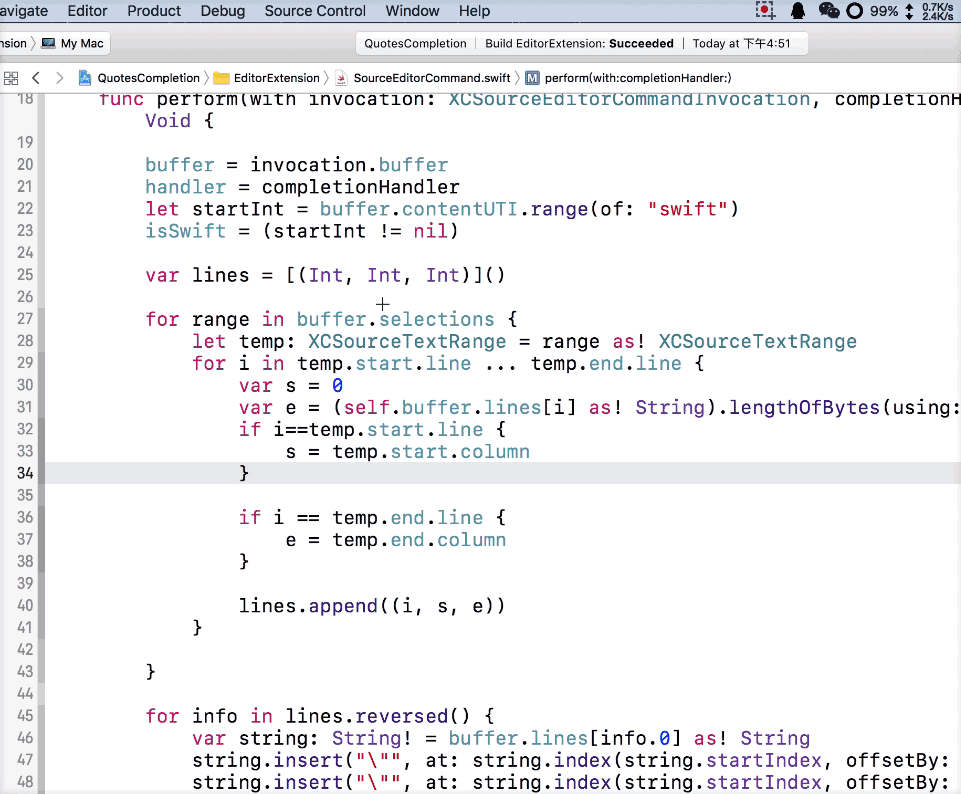

# Introduction
Quotes Completion (Xcode8 Editor Extension)
 
快速添加引号，支持 swift、Objective-C
 
 

# Install
* **OSX 10.11 only** sudo /usr/libexec/xpccachectl 
* Download, unzip and run <a href ="https://github.com/keepyounger/QuotesCompletion/blob/master/QuotesCompletion.zip?raw=true"> QuotesCompletion </a> 
*  -> System Preferences... -> Extensions -> All -> Enable QuotesCompletion 
* You can set a shortcut (Key-Binding) for QuotesCompletion using Xcode. 
* Xcode -> Preferences... -> Key Bindings (Filter "QuotesCompletion") 

-------

* 在 **OSX 10.11** 上，需要先执行Command: sudo /usr/libexec/xpccachectl 
* 下载, 解压 并运行 <a href ="https://github.com/keepyounger/QuotesCompletion/blob/master/QuotesCompletion.zip?raw=true"> QuotesCompletion </a> 
*  -> 系统偏好设置...-> 扩展-> 全部 -> 勾选QuotesCompletion 
* 你可以用Xcode设置快捷键。 
* Xcode -> Preferences... -> Key Bindings (Filter "QuotesCompletion") 

# Download
<a href ="https://github.com/keepyounger/QuotesCompletion/blob/master/QuotesCompletion.zip?raw=true"> QuotesCompletion </a>  

# Support
Xcode 8 or later

